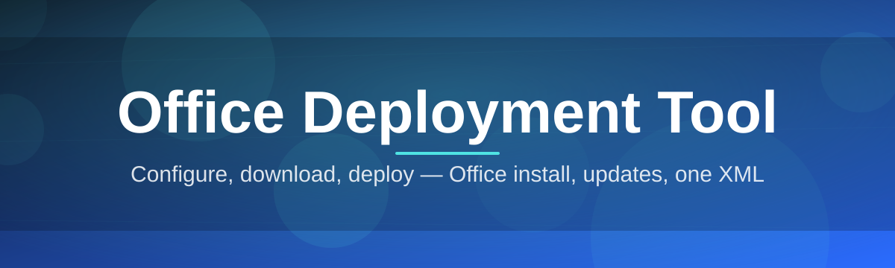

# office-deployment-tool 📦⚙️

  

*A calm, predictable way to configure, package, and roll out Office installations across any number of machines.*

---

## 🔍 Overview

**office-deployment-tool** is a standalone Windows utility built around the Office Deployment Tool (ODT) workflow — the configuration-driven method Microsoft ships for installing Office without touching the Store or a per-seat installer wizard. Instead of hand-editing XML and memorizing product IDs, channel names, and language packs, you get a visual layer on top of the same underlying engine: pick a channel, pick the apps, pick the architecture, and generate a deployment package that behaves exactly the way IT admins expect.

This project exists because Office deployment has always lived in an awkward spot — too structured for a GUI installer, too fiddly for most people to do by hand every time a new machine needs provisioning. Configuration files drift, channel names get typo'd, and Click-to-Run silently pulls the wrong build. office-deployment-tool closes that gap by treating configuration as a first-class, inspectable artifact rather than a one-off command you forget you ran.

It's aimed at IT technicians re-imaging fleets of laptops, sysadmins standardizing Office builds across a company, and power users who just want a clean, repeatable Office install without the Store version's background noise. No telemetry theater, no dependency chain, no login wall — just a tool that turns Office configuration into something you can see, save, and reuse.

  

---

## 📋 Requirements

| Requirement | Details |
|---|---|
| **OS** | Windows 10 (64-bit) or Windows 11 |
| **Architecture** | x64 / ARM64 supported |
| **Dependencies** | None — fully standalone binary |
| **Disk space** | ~15 MB for the tool itself; Office downloads sized per product |
| **Permissions** | Administrator recommended for system-wide deployment |
| **Network** | Required only during the actual Office download/install step |
| **.NET / Runtime** | Not required — no external runtime installs |

> [!NOTE]
> The tool itself never bundles Office binaries. It orchestrates Microsoft's official Click-to-Run channels, so what you install is always sourced directly from Microsoft's CDN.

---

## 🧩 What It Actually Does

| Capability | Description |
|---|---|
| **Configuration Builder** | Visually assemble the XML configuration Office deployment relies on — apps, channel, language, architecture — without opening a text editor. |
| **Channel Switching** | Jump between Current, Monthly Enterprise, Semi-Annual, and Beta channels to match your organization's update cadence. |
| **Selective App Install** | Include or exclude individual apps (Word, Excel, Outlook, Access, Publisher, Teams, OneNote) instead of installing the whole suite by default. |
| **Language & Locale Packs** | Layer additional proofing and UI languages onto a base install without re-running the whole deployment. |
| **Offline Package Prep** | Pre-download install sources onto removable media or a network share for machines with limited or no internet access. |
| **Silent Deployment Mode** | Generate configs tuned for unattended rollout — no click-through dialogs, no user prompts mid-install. |
| **Removal & Version Downgrade** | Cleanly uninstall existing Office builds or step a machine back to a previous channel version when a new build misbehaves. |
| **Config Snapshots** | Save named configuration profiles so a "sales laptop" build and an "accounting workstation" build never get confused. |

> [!TIP]
> Save a snapshot the moment a config works well. Six months later, when someone asks "how did we set up the finance team's Office," you'll have the answer in two clicks instead of an archaeology dig through old emails.

---

## 🚀 How to Get Started

1. **Visit the landing page** using the download button above — that's the only place this project ships from.

2. **Download the executable** — no installer wizard, no bundled extras, just the tool.

3. **Run it directly** on the target Windows machine (administrator privileges recommended for full deployment rights).

4. **Build your configuration**, preview the generated XML, and launch the deployment — Office installs using Microsoft's own Click-to-Run engine underneath.

> [!IMPORTANT]
> Close any running Office applications before deploying. Click-to-Run cannot safely swap files that are currently open in memory, and a mid-install crash can leave a partial install behind.

---

## 🧠 How It Works

The tool sits as a friendly control layer on top of Microsoft's native deployment engine — it doesn't reinvent Office installation, it makes the existing mechanism legible.

1. You define what you want: apps, channel, architecture, languages.
2. The tool serializes that into a valid ODT configuration file.
3. It hands that configuration to the Click-to-Run engine.
4. The engine streams the required files from Microsoft's servers.
5. Office lands on the machine, already matching your exact spec.

> [!NOTE]
> Because the actual install step is handled by Microsoft's own engine, deployments stay compatible with future Office updates — the tool just keeps the configuration layer clean and readable.

---

## 🩹 Troubleshooting

<strong>The deployment seems to hang at "Downloading"</strong>

This is almost always network-bound, not tool-bound. Click-to-Run streams the full app package on first run, which can be several gigabytes depending on selected apps. Check your connection or switch to offline package prep from a faster network.

<strong>Office installed, but a language pack is missing</strong>

Re-open the configuration builder, add the missing language under the locale section, and re-run deployment. Layering an additional language does not require uninstalling the base product first.

<strong>I switched channels but the version number didn't change</strong>

Channel switches only take effect on the next update cycle unless you explicitly force a version match in the configuration. Enable "Match exact version" before deploying if you need an immediate jump.

<strong>Deployment fails with a permissions error</strong>

Run the tool as Administrator. Office deployment writes to protected system directories, and a standard user token will be rejected partway through install.

<strong>Can I roll back to a previous Office build?</strong>

Yes — the removal & downgrade option lets you specify an exact prior version, provided that version is still available in Microsoft's update history for your selected channel.

---

## 🎨 UI / UX Details

 

- **Themes** — Light and Dark, following the OS accent color automatically.

- **Keyboard shortcuts**:

| Shortcut | Action |
|---|---|
| `Ctrl + N` | New configuration |
| `Ctrl + S` | Save configuration snapshot |
| `Ctrl + Enter` | Run deployment |
| `Ctrl + P` | Preview generated XML |
| `Esc` | Cancel active operation |

- **Settings persistence** — last-used channel, app selection, and language set are remembered between sessions.

- **XML preview pane** — always visible before deployment, so nothing runs blind.

> [!WARNING]
> Editing the raw XML preview directly is possible but unsupported in the visual builder — malformed tags will be rejected on the next save rather than silently ignored.

---

## 🤝 Contributing & Community

Contributions, issue reports, and feature discussions are welcome. Whether you're fixing a channel-naming edge case or proposing a new configuration template, the workflow is straightforward:

> Open an issue describing the behavior → discuss the approach → submit a focused pull request.

- Keep pull requests scoped to one change.

- Include before/after config XML examples when relevant.

- Be specific about which Windows build and Office channel you tested against.

---

## 📄 License

Licensed under the **MIT License**, 2026.

See [MIT License](LICENSE) for full terms.

---

## ⚠️ Disclaimer

office-deployment-tool is an independent, community-maintained utility built around Microsoft's publicly documented Office Deployment Tool workflow. It is not affiliated with, endorsed by, or sponsored by Microsoft Corporation. All Office product names, trademarks, and installation sources remain the property of their respective owners. Use this tool in accordance with your organization's software licensing terms.

  

